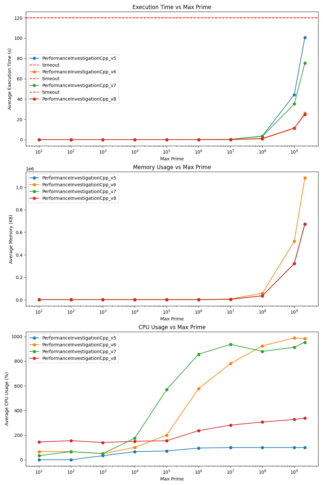

# jetbrains-perf-investigation
Test task solution for JetBrains PerformanceInvestigationCpp.

## Work done
- Optimization of initial solution done (multiple implementations presented);
- [Benchmark](https://github.com/yurysup/jetbrains-perf-investigation/blob/main/benchmark.py) tool (+ [calibration](https://github.com/yurysup/jetbrains-perf-investigation/blob/main/analysis/Benchmark_calibration.docx)) is created;
- Performance analysis & optimization steps described in a [report](https://github.com/yurysup/jetbrains-perf-investigation/blob/main/analysis/Optimization.docx);
- Performance issues described in a [report](https://github.com/yurysup/jetbrains-perf-investigation/blob/main/analysis/Performance_issues.docx);

## Results achieved

Best processing time achieved (for INT_MAX):
- v8: 24.9s
- v6: 26.1s
- v7: 75.5s

Best memory efficiency achieved (for INT_MAX):
- v5, v7, v8: ~673Mb
- v6: ~1Gb



## Installation
Benchmark requires:
[Python 3](https://www.python.org/) v3.9 to run.
Install Python dependencies:
```
pip install -r requirements.txt
```
[GNU Time](https://www.gnu.org/software/time/) to measure process metrics (e.g. CPU/Memory utilization):
```
brew install gnu-time
```

## Benchmark features
- adaptable config
- warmup
- multiple iterations benchmark
- process timeout handling
- execution time measurement (using Python [time.perf_counter()](https://docs.python.org/3/library/time.html))
- Memory / CPU measurement (using [GNU Time](https://www.gnu.org/software/time/))
- summary reporting: csv and graph (with comparison between multiple binaries benchmarked)

### Benchmark calibration
Investigation into dependency of measurement precision on: 
- number of iterations
- time measurement function
-  number of warmup iterations
-  gtime overhead 

is provided at [benchmark calibration report](https://github.com/yurysup/jetbrains-perf-investigation/blob/main/analysis/Benchmark_calibration.docx).

### Execution

Set configurations in `benchmark_conf.json` [file](https://github.com/yurysup/jetbrains-perf-investigation/blob/main/benchmark_conf.json).

Execute `benchmark.py` [file](https://github.com/yurysup/jetbrains-perf-investigation/blob/main/benchmark.py).
```
python3 benchmark.py
```

Report will be generated at `/reports` dir:

- report.csv (summary metrics)
- comparison.png (graphs with exec time, memory & cpu utilization)

Human-readable output is provided in console.

> :warning: **_NOTE:_**  Check for timeout messages as timedout processes won't be added to report (e.g. Timeout reached for PerformanceInvestigationCpp_v0 with maxPrime = 1000000. Skipping...).

## Performance analysis & optimization

[Optimization report](https://github.com/yurysup/jetbrains-perf-investigation/blob/main/analysis/Optimization.docx) added at `/analysis` dir with benchmark and profiling results.

Performance issues found in original solution are added to [issues report](https://github.com/yurysup/jetbrains-perf-investigation/blob/main/analysis/Performance_issues.docx).

### Versions available

All compiled binaries can be found at `/bin`.
All sources (benchmarked app versions) can be found at `/archive`.
Main implementation is located at `main.cpp`.
